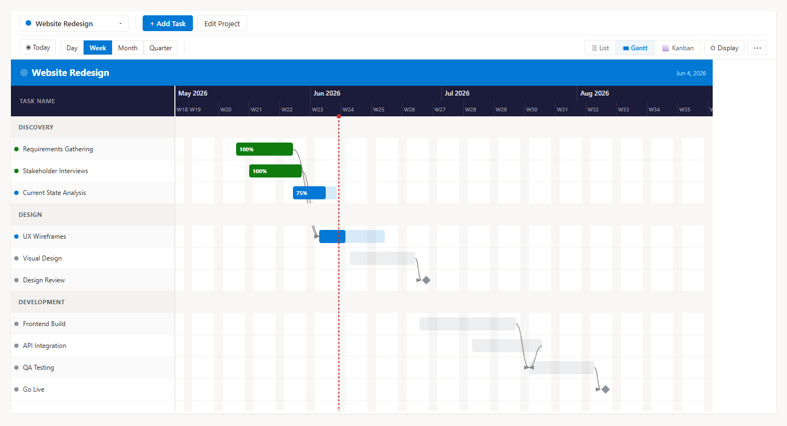
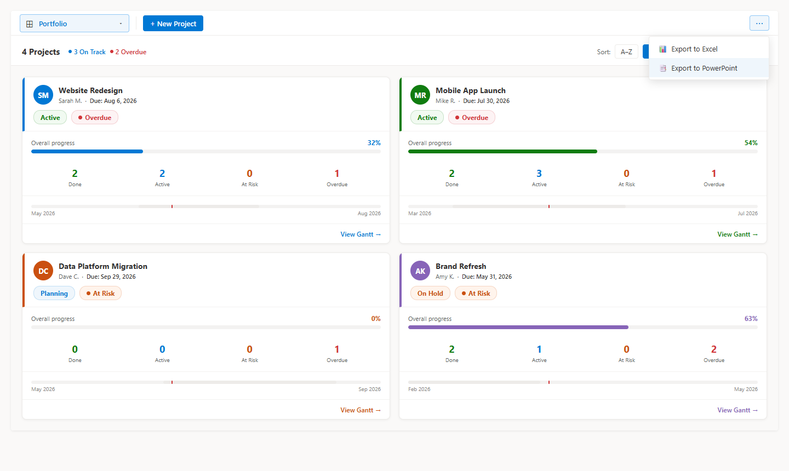
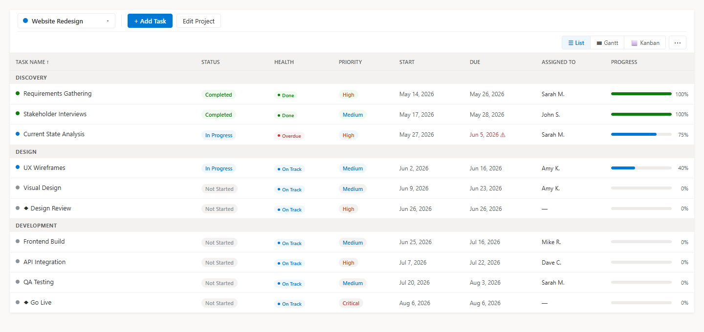
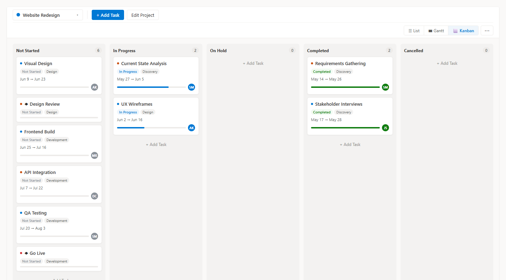
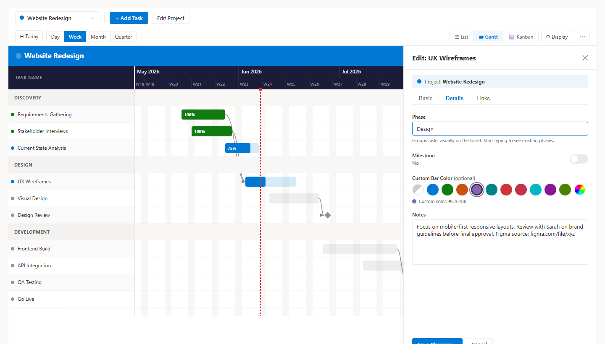
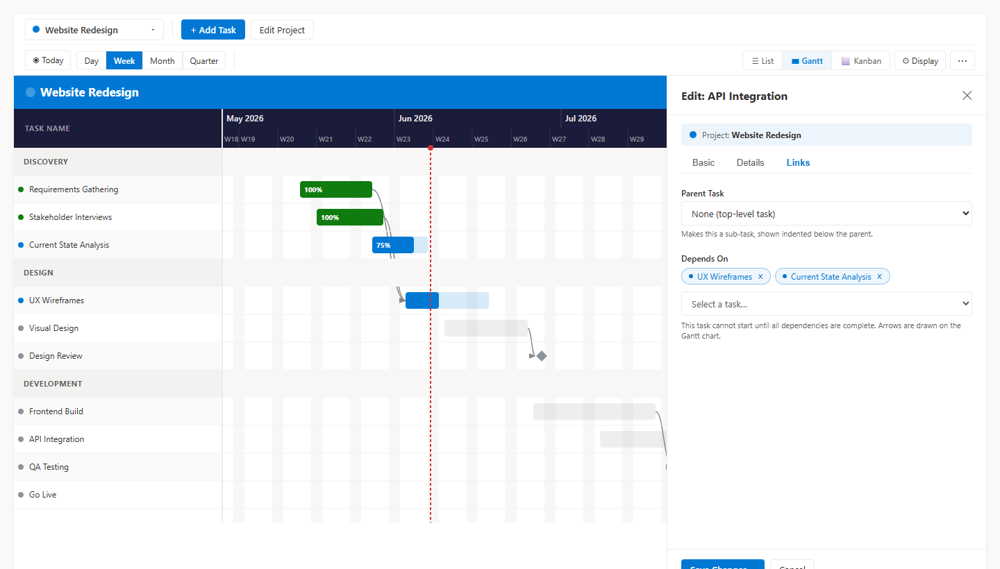
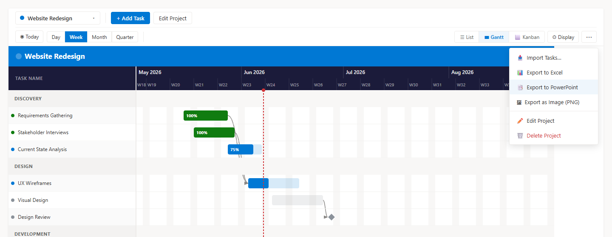
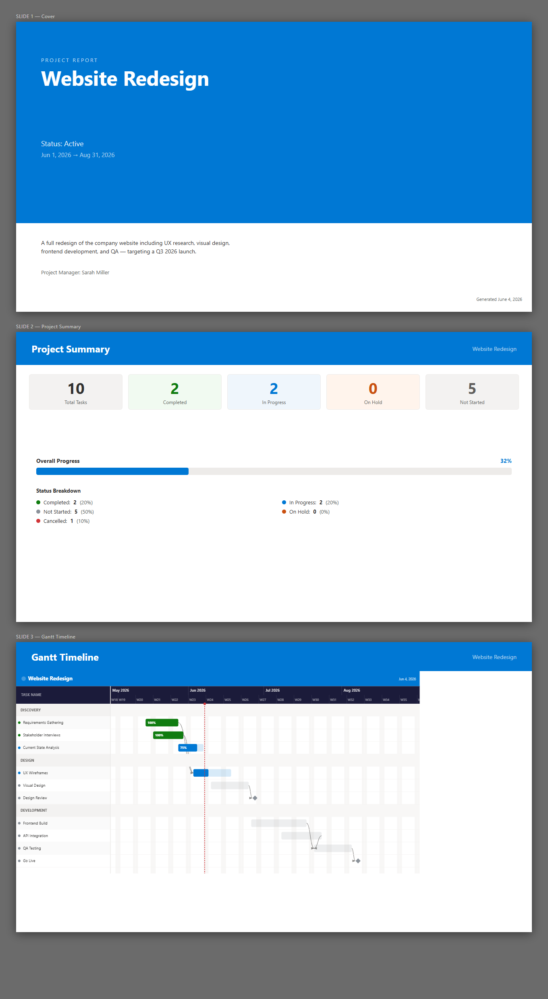
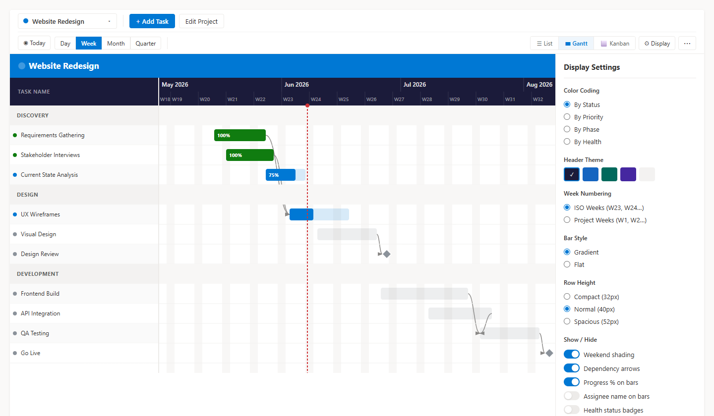

# SharePoint Smart Gantt Chart — SPFx Project Management Web Part

[](https://sharepointsmartsolutions.com/smart-gantt)
[](USER-GUIDE.md)
[](../../releases/latest)
[](LICENSE)

A SharePoint Framework (SPFx) web part for project management with five views — Portfolio, Gantt chart, List, Kanban board, and Dashboard — all backed by SharePoint lists.

     



---

## Features

- **Portfolio View** — Cross-project overview showing all projects as summary cards with computed health indicators, progress bars, task counts, and a mini date-range timeline. Accessible from the project selector dropdown.
- **Health Status** — Automatic "On Track / At Risk / Overdue" indicators computed from each task's dates and progress percentage — no manual entry required. Shown as badges in the List, Kanban, Gantt tooltip, and Portfolio views, with a "By Health" Gantt bar color option.
- **Gantt Chart** — Custom SVG timeline with drag-to-move, drag-to-resize, dependency arrows, phase grouping, zoom levels (Day / Week / Month / Quarter), and a today indicator
- **List View** — Sortable, Excel-style grid with inline status and priority editing, overdue highlighting, progress bars, and health badges
- **Kanban Board** — Drag-and-drop cards across status columns (Not Started → In Progress → On Hold → Completed → Cancelled), with health badges on each card
- **Task Filter Bar** — Third toolbar row with text search, multi-select Status / Priority / Assignee / Phase filters, and a due-date filter (Overdue / Due Today / Due in 7 days). Active filters persist across view switches; a match count and one-click Clear keep filtering fast
- **Project management** — Each project gets its own SharePoint list with 15 pre-built columns (status, priority, dates, assignee, % complete, phase, milestones, dependencies, and more)
- **Display settings** — Customize colors (including by health), header theme, week numbering, bar style, row height, and show/hide toggles including health badges
- **Export** — Download tasks as Excel, export a full PowerPoint project report (cover, summary, Gantt chart, and recent activity), or save the Gantt as a high-resolution PNG
- **Import** — Bring in tasks from Excel/CSV files (including MS Project exports) or directly from Microsoft Planner, with a column-mapping screen for non-standard headers
- **Autocomplete** — Phase and Assigned To fields suggest values already used in the project

---

## Views

### Portfolio View



- Accessible from the **project selector dropdown** (⊞ Portfolio) — not a tab in the view switcher
- Responsive card grid showing all projects at a glance
- Each card shows: project name, manager avatar, manual status badge, computed health badge, overall progress bar, task count breakdown (Done / Active / At Risk / Overdue), and a mini timeline bar with a today marker
- Header bar shows aggregate health summary (X On Track / Y At Risk / Z Overdue) across all projects
- Sort cards by name, health, status, or completion percentage
- Click any card to navigate directly into that project's Gantt view

### Gantt Chart


- Colored project title bar at the top of the timeline
- Two-row toolbar: project/task actions on the first row; view and zoom controls on the second
- Sticky task list on the left; scrollable SVG timeline on the right
- Four zoom levels: Day, Week, Month, Quarter
- Task bars color-coded by status, priority, phase, or health; progress overlay shows % complete
- Drag a bar horizontally to move dates; drag the right edge to resize
- Dependency arrows drawn between tasks
- Phase rows collapse/expand to group related tasks
- Hover tooltip shows task name, dates, status, priority, assignee, % complete, and health indicator
- Today line with red indicator

### List View



- Click any column header to sort ascending/descending
- Change status or priority inline via dropdown — saves to SharePoint immediately
- **Health** column shows an automatic On Track / At Risk / Overdue badge for each task
- Overdue tasks highlighted in red
- Phase group rows visually separate tasks
- Subtasks indented under their parent

### Kanban Board



- Five columns matching task statuses
- Drag cards between columns to update status
- Cards show priority color, tags, health badge, due date, assignee avatar, and progress bar
- Add Task button in each column

### Task Panel

Click any task name or **+ Add Task** to open the task panel. It has three tabs:

| Tab | Key fields |
|---|---|
| **Basic** | Name, description, dates, status, priority, % complete slider, assigned to |
| **Details** | Phase (auto-colors the bar), milestone toggle, custom bar color picker, notes |
| **Links** | Parent task (sub-task hierarchy), dependencies (removable chips + dropdown) |




---

## Display Settings

Click **⚙ Options** in the toolbar (visible when a project is selected) to open the settings panel.

| Setting | Options |
|---|---|
| **Color Coding** | By Status, By Priority, By Phase (each phase gets a consistent auto-color), **By Health** (On Track = blue, At Risk = orange, Overdue = red) |
| **Header Color** | Dark (default), Navy, Teal, Purple, Light |
| **Week Numbering** | ISO weeks (W23, W24…) or Project-relative (W1, W2, W3… from the first task's start date) |
| **Bar Style** | Gradient or Flat |
| **Row Height** | Compact (36px), Normal (40px), Spacious (52px) |
| **Show / Hide** | Weekend shading, dependency arrows, progress % on bars, assignee name on bars, **health status badges** |

Settings are applied live and remembered for the session.

**Project-relative week numbers** are particularly useful for presentations — stakeholders can refer to "Week 3" without needing to know the calendar date.

---

## Exporting



All export options are in the **⋯ menu** (top-right of the toolbar).

### Export to Excel

Downloads `<ProjectName> - Tasks.xlsx` with all task columns (name, phase, dates, status, priority, assignee, % complete, milestone flag, notes). Columns are auto-sized to their content.

### Export to PowerPoint



Downloads `<ProjectName> - Project Report.pptx` — a four-slide deck:

| Slide | Contents |
|---|---|
| **Cover** | Project title, status, date range, description, and project manager |
| **Summary** | Task counts by status, overall progress bar, and status breakdown |
| **Gantt Timeline** | Full Gantt chart rendered as a high-resolution PNG image |
| **Summary & Recent Activity** | Project overview on the left; tasks completed or updated in the past 7 days on the right |

### Export as Image (PNG)

Renders the full Gantt chart — every task, the complete date range, the project title bar, and the current color/theme settings — as a clean 2× high-resolution PNG. No browser window cropping. Suitable for pasting directly into Word or email.

The export uses the current Display Settings, so you can tune colors and layout before exporting.

---

## Requirements

| Requirement | Version |
|---|---|
| Node.js | 18.x |
| SharePoint Online | Any |
| SPFx | 1.20.0 |
| Permissions | Site Member or above (list creation requires Site Owner on first use) |

For **Planner import**, a Microsoft 365 admin must approve Graph API permissions once after deployment (see [Planner Import Setup](#planner-import-setup)).

---

## External / Guest User Access

The web part supports **Microsoft 365 guest users** (Azure AD B2B external collaborators) with a small set of caveats.

### What guests can do

Once a guest has been invited to the SharePoint site and granted **Site Member (Contribute)** permission by a Site Owner, they can:

| Feature | Supported |
|---|---|
| View projects, tasks, and all views (Portfolio, Gantt, List, Kanban, Dashboard) | ✅ |
| Add, edit, and delete tasks | ✅ |
| Export to Excel, PowerPoint, and PNG | ✅ (all client-side) |
| Be assigned to tasks | ✅ (Assigned To is a plain-text field — no Azure AD lookup required) |
| Import tasks from Excel / CSV | ✅ |

### What guests cannot do

| Feature | Limitation | Workaround |
|---|---|---|
| **Create new projects** | Requires "Manage Lists" permission — guests cannot be Site Owners | An internal Site Owner or Member creates the project; guests work within it |
| **Planner import** | Requires `Group.Read.All` Graph permission; guests typically cannot read organizational Planner plans | Export the Planner plan to Excel first, then import via the Excel path |

### Setting up guest access

1. In the SharePoint site, go to **Settings → Site Permissions → Invite People**
2. Enter the guest's email address — they'll receive an invitation email
3. Grant them **Edit** (Contribute) permission, which maps to Site Member access
4. An internal Site Owner should create any new projects before the guest arrives; the guest can then manage all tasks within those projects

> **Note:** Guests must accept the SharePoint invitation and sign in with their Microsoft account (personal, work, or school) before they can access the site. This is standard Microsoft 365 B2B guest behavior and is not specific to this web part.

---

## Getting Started

> **No build required.** Download the pre-built `.sppkg` from the [latest release](../../releases/latest), upload it to your App Catalog, and you're done. The steps below are only needed if you want to modify or develop the web part.

### Deploy (no build needed)

1. Go to the [latest release](../../releases/latest) and download `sharepoint-smart-gantt-chart.sppkg`
2. Upload it to your **SharePoint App Catalog** (tenant-wide or site collection)
3. Approve any API permission requests if prompted (required for Planner import only — see [Planner Import Setup](#planner-import-setup))
4. Add the **Smart Gantt Chart** web part to any SharePoint page

That's it — no Node.js, no build tools, no configuration files.

---

### Develop (build from source)

#### 1. Clone and install

```bash
git clone <repo-url>
cd SharePointSmartGanttChart
npm install
```

#### 2. Configure the workbench URL

`config/serve.json` is excluded from the repo (it contains your tenant URL). Copy the example file and fill in your tenant:

```bash
cp config/serve.json.example config/serve.json
```

Then edit `config/serve.json`:

```json
{
  "port": 4321,
  "https": true,
  "initialPage": "https://<your-tenant>.sharepoint.com/_layouts/15/workbench.aspx"
}
```

#### 3. Trust the dev certificate (first time only)

```bash
gulp trust-dev-cert
```

#### 4. Run the dev server

```bash
gulp serve
```

The browser will open to your SharePoint workbench. Add the **Smart Gantt Chart** web part from the toolbox.

---

## Building for Production

```bash
# Bundle (minified)
gulp bundle --ship

# Package the .sppkg
gulp package-solution --ship
```

Upload `sharepoint/solution/sharepoint-smart-gantt-chart.sppkg` to your **SharePoint App Catalog**.

---

## How It Works

### SharePoint lists

The web part creates and manages two types of lists on the current site:

| List | Purpose |
|---|---|
| `SmartGantt_Projects` | Registry of all projects (created automatically on first use) |
| `SGP_<ProjectName>_<id>` | One list per project, containing all tasks |

**Project list columns** (created automatically):

| Column | Type | Notes |
|---|---|---|
| Title | Text | Task name |
| TaskDescription | Note | Optional description |
| StartDate | DateTime | |
| DueDate | DateTime | |
| Status | Choice | Not Started / In Progress / Completed / On Hold / Cancelled |
| Priority | Choice | Critical / High / Medium / Low |
| PercentComplete | Number | 0–100 |
| AssignedToName | Text | Assignee display name |
| AssignedToEmail | Text | Assignee email |
| Phase | Text | Groups tasks on the Gantt |
| IsMilestone | Boolean | Renders as a diamond on the Gantt |
| ParentTaskId | Number | ID of parent task (for subtask hierarchy) |
| Dependencies | Text | Comma-separated task IDs |
| Notes | Note | Rich notes field |
| TaskColor | Text | Hex color override (auto-colors by status if blank) |
| SortOrder | Number | Display order |

---

## Importing Tasks

Access import from the **⋯ menu** → **Import Tasks…**

### From Excel or CSV

1. Drop or browse for a `.xlsx`, `.xls`, `.csv`, or `.ods` file
2. The importer reads the first sheet and detects headers
3. Common column names are auto-mapped (e.g. "Owner" → Assigned To, "Finish" → Due Date)
4. Unrecognized columns appear in the column mapper — assign each to a Smart Gantt field or mark as Skip
5. A preview shows the first 3 rows with mapped values
6. Click **Import** to create all tasks

**Microsoft Project Desktop:** Use File → Save As → Excel Workbook (.xlsx) in Project, then import that file. All standard Project columns are recognized automatically.

### From Microsoft Planner

1. Select **Microsoft Planner** as the source
2. Browse the list of Planner plans you have access to
3. Select a plan — tasks load automatically
4. Planner buckets become Phases; assignments, dates, and % complete are mapped automatically
5. Click **Import**

#### Planner Import Setup

Planner import requires Graph API permissions approved once by a Microsoft 365 admin:

1. Deploy the `.sppkg` to the App Catalog
2. In the **SharePoint Admin Center**, go to **Advanced → API Access**
3. Approve the following requests:
   - `Microsoft Graph — Tasks.Read`
   - `Microsoft Graph — Group.Read.All`
   - `Microsoft Graph — User.ReadBasic.All`

These permissions are tenant-wide and only need to be approved once.

---

## Sample Data

Two ready-to-import `.xlsx` files are included in [`docs/sample-data/`](docs/sample-data/) to help you try the import feature immediately.

| File | Scenario | Phases | Tasks |
|---|---|---|---|
| `Tech-Conference-Tasks.xlsx` | Annual tech conference planning, conference days Oct 1–2 2026 | Planning, Content, Logistics, Marketing | 25 |
| `Website-Rollout-Tasks.xlsx` | Corporate website redesign and launch project | Discovery, Design, Build, Launch | 20 |
| `ERP-Implementation-Tasks.xlsx` | Cloud ERP implementation (Finance + HR modules), Apr–Oct 2026 | Discovery & Planning, Design & Configuration, Data Migration, Build & Integration, Testing & Training, Go-Live & Hypercare | 31 |

Import either file via **⋯ menu → Import Tasks…** — all columns are named to match Smart Gantt's auto-mapping, so no manual column mapping is required.

---

## Project Structure

```
src/
└── webparts/smartGantt/
    ├── SmartGanttWebPart.ts              # Web part entry point
    ├── SmartGanttWebPart.manifest.json
    ├── models/
    │   └── index.ts                      # IProject, ITask, IGanttDisplaySettings,
    │                                     # TaskHealth, ProjectHealth, IProjectTaskStats,
    │                                     # color constants, theme definitions
    ├── utils/
    │   └── healthUtils.ts                # computeTaskHealth, computeProjectHealth,
    │                                     # healthColor, healthLabel — pure functions, no React
    ├── services/
    │   ├── SharePointService.ts          # All SharePoint list operations (PnPjs);
    │                                     # includes getProjectTaskStats, getAllProjectStats
    │   ├── ImportService.ts              # Excel parsing, Planner Graph calls, batch import
    │   └── ExportService.ts              # Excel export, SVG/PNG Gantt rendering
    └── components/
        ├── SmartGantt.tsx                # Root component — state, routing between views
        ├── toolbar/
        │   └── Toolbar.tsx               # Two-row toolbar: project selector (with Portfolio
        │                                 # entry) + view controls
        ├── gantt/
        │   ├── GanttChart.tsx            # Custom SVG Gantt chart
        │   └── GanttSettings.tsx         # Display settings panel
        ├── views/
        │   ├── ListView.tsx              # Sortable grid view with health column
        │   ├── KanbanView.tsx            # Drag-and-drop Kanban board with health badges
        │   ├── DashboardView.tsx         # Summary stats and recent activity
        │   └── PortfolioView.tsx         # Cross-project card grid with health and stats
        ├── panels/
        │   ├── ProjectPanel.tsx          # Create / edit project side panel
        │   └── TaskPanel.tsx             # Create / edit task side panel (3 tabs)
        ├── common/
        │   ├── AutocompleteField.tsx     # Reusable keyboard-navigable suggestion input
        │   └── HealthBadge.tsx           # On Track / At Risk / Overdue / Done pill badge
        └── import/
            ├── ImportPanel.tsx           # 4-step import flow
            └── ColumnMapper.tsx          # Column mapping UI with auto-map and preview
```

---

## Tech Stack

| Library | Version | Purpose |
|---|---|---|
| SPFx | 1.20.0 | SharePoint web part framework |
| React | 17.0.1 | UI |
| Fluent UI | 8.125.6 | Microsoft design system components |
| PnPjs | 3.26.0 | SharePoint REST API client |
| SheetJS (xlsx) | 0.18.5 | Excel/CSV file parsing and export |
| pptxgenjs | 4.0.1 | PowerPoint export |
| date-fns | 2.30.0 | Date calculations for Gantt rendering and export |

Microsoft Graph is accessed via the SPFx built-in `msGraphClientFactory` — no extra SDK required.

---

## Configuration

The web part has one property pane setting:

| Property | Default | Description |
|---|---|---|
| Title | Smart Gantt Chart | Web part display title |

All other configuration (projects, tasks, colors, display settings) is managed through the web part UI itself.

---

## Troubleshooting

**"You do not have permission to create lists"** — Project creation requires Site Owner permissions. Ask your SharePoint site owner to create the first project, after which Site Members can manage all tasks within it.

**"Planner plans are not showing up"** — The three Microsoft Graph permissions (`Tasks.Read`, `Group.Read.All`, `User.ReadBasic.All`) have not been approved. A Microsoft 365 admin must approve them once in **SharePoint Admin Center → Advanced → API Access**. See [Planner Import Setup](#planner-import-setup).

**`gulp serve` fails with a certificate error** — Run `gulp trust-dev-cert` once to install the local dev certificate, then retry `gulp serve`.

**`gulp serve` fails with a Node version error** — SPFx 1.20.0 requires Node 18.x exactly. Use [nvm-windows](https://github.com/coreybutler/nvm-windows) to switch: `nvm use 18`.

**Portfolio view is slow to load** — Stats for all projects are fetched in parallel on first visit. For portfolios with 20+ projects, this may take several seconds. A loading spinner is displayed while fetching. Stats are cached until the next project or task change.

**Display settings reset after a page reload** — This is expected behavior in the current version. Settings are session-only and reset on reload. See [Known Limitations](#known-limitations).

---

## Known Limitations

- **MS Project Desktop (.mpp files)** — the binary `.mpp` format cannot be parsed in a browser. Use File → Save As → Excel in Project Desktop instead.
- **Planner import** requires admin approval of Graph permissions (one-time setup).
- **Dependencies** imported from Excel are stored as text and not auto-resolved to task IDs across imports.
- **Display settings** are session-only and reset on page reload. Future work could persist them to the web part property bag.
- The web part requires **Site Owner** permissions on the SharePoint site for the first project creation (list creation). Subsequent task operations work with Site Member permissions.
- **Guest users** cannot create projects (list creation requires elevated permissions), but can fully manage tasks in existing projects. See [External / Guest User Access](#external--guest-user-access) for setup instructions.
- **Portfolio view** loads task stats for all projects in parallel on first visit. For portfolios with 30+ projects this may take a few seconds; a spinner is shown while loading.

---

## Screenshots

| | |
|---|---|
| **Portfolio view** | **Gantt chart** |
|  |  |
| **List view with Health column** | **Kanban board** |
|  |  |
| **Display Settings** | **Export menu** |
|  |  |
| **Task panel — Details tab** | **Task panel — Links tab** |
|  |  |

---

## License

[MIT](LICENSE) © 2026 Sean Regan
