# Smart Gantt Chart — User Guide · v1.5.0

---

## Table of Contents

1. [Getting Started](#1-getting-started)
2. [Creating Your First Project](#2-creating-your-first-project)
3. [Adding and Editing Tasks](#3-adding-and-editing-tasks)
4. [Filtering Tasks](#4-filtering-tasks)
5. [Gantt Chart View](#5-gantt-chart-view)
6. [List View](#6-list-view)
7. [Kanban View](#7-kanban-view)
8. [Dashboard View](#8-dashboard-view)
9. [Portfolio View](#9-portfolio-view)
10. [Health Status Indicators](#10-health-status-indicators)
11. [Display Settings](#11-display-settings)
12. [Exporting](#12-exporting)
13. [Importing Tasks](#13-importing-tasks)
14. [Working with Multiple Projects](#14-working-with-multiple-projects) (archive, unarchive, delete)
15. [Accessibility and Touch Support](#15-accessibility-and-touch-support)
16. [Language Support](#16-language-support)
17. [Tips and Tricks](#17-tips-and-tricks)

---

## 1. Getting Started

When you first add the **Smart Gantt Chart** web part to a SharePoint page, it will create a background list called `SmartGantt_Projects` on the current site to track your projects. You'll see this message:

> *No projects yet — Create your first project*

You'll need **Site Owner** permissions on the SharePoint site for this first-time setup (list creation). After that, any **Site Member** can add tasks, edit tasks, and switch views.

---

## 1a. Guest & External User Access

Microsoft 365 **guest users** (external collaborators invited via Azure AD B2B) are fully supported for day-to-day project work, with two exceptions.

### What guests can do

Guests who have been invited to the SharePoint site and granted **Site Member (Contribute)** permission can:

- View projects in all views — Portfolio, Gantt, List, Kanban, and Dashboard
- Add, edit, and delete tasks
- Export to Excel, PowerPoint, and PNG
- Import tasks from an Excel or CSV file
- Be listed as "Assigned To" on any task — type the person's name (and optionally an email) as free text; no Azure AD account lookup is required

### What guests cannot do

| Action | Reason | Workaround |
|---|---|---|
| **Create a new project** | Creating a SharePoint list requires "Manage Lists" permission, which is not available to guests | Have an internal Site Owner or Member create the project; the guest then manages tasks within it |
| **Planner import** | Reading organizational Planner plans via the Microsoft Graph requires a same-tenant license; guests are typically excluded | Export the Planner plan to Excel (Planner → Export plan → Excel), then use the Excel import path |

### Inviting a guest

1. Go to the SharePoint site → **Settings → Site Permissions → Invite People**
2. Enter the guest's email address and set their permission to **Edit** (Contribute / Site Member)
3. The guest receives an email invitation; they must sign in with a Microsoft account before accessing the site
4. Once in, they can use the web part immediately for any projects that already exist

> **Tip:** Create all projects you want the guest to work in *before* they arrive, so they can start adding tasks right away without waiting for an owner to be available.

---

## 2. Creating Your First Project

1. Click **+ New Project** in the toolbar (or click the project selector and choose **+ New Project** at the bottom of the dropdown).

2. Fill in the project details:

   | Field | Description |
   |---|---|
   | **Project Name** | Required. Shown in the title bar and project selector. |
   | **Description** | Optional. A short summary of what the project is about. |
   | **Color** | Pick a color — it's used as the project accent color throughout the Gantt view. |
   | **Project Manager** | Optional. Search your directory as you type, or enter a name (with an optional email) for someone outside it. |
   | **Status** | Planning, Active, On Hold, Completed, or Canceled. |
   | **Start Date / Due Date** | Optional project-level date range. |

3. Click **Create Project**.

   A new SharePoint list is created in the background for this project's tasks. You'll see it in the project selector from now on.

> **Tip:** Choose a distinct color for each project if you manage several — it makes switching between them much easier at a glance.

---

## 3. Adding and Editing Tasks

### Adding a task

Click **+ Add Task** in the toolbar. The task panel slides in from the right with three tabs.

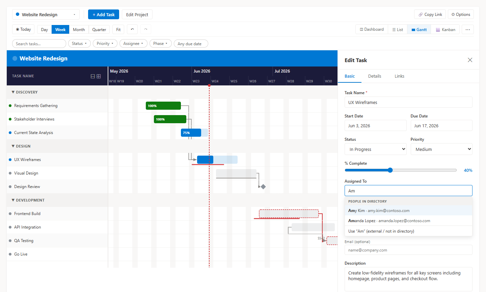

#### Basic tab

| Field | Notes |
|---|---|
| **Task Name** | Required. Keep it short — it's what appears on the Gantt bar. |
| **Description** | Optional longer description. |
| **Start Date / Due Date** | Used to position and size the bar on the Gantt chart. |
| **Status** | Not Started · In Progress · Completed · On Hold · Canceled |
| **Priority** | Critical · High · Medium · Low |
| **% Complete** | Drag the slider 0–100. Setting Status to Completed auto-sets this to 100. |
| **Assigned To** | People picker — start typing to search your directory, or pick from recently used people. For someone who isn't in the directory, choose **Use "name" (external / not in directory)** and optionally add an email; they're saved as free text. |

#### Details tab

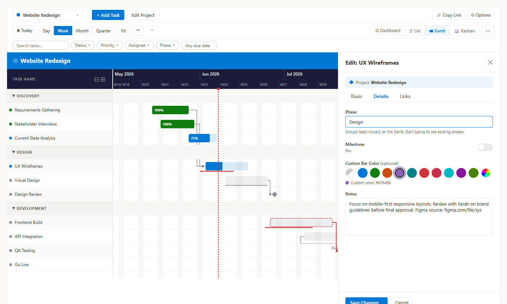

| Field | Notes |
|---|---|
| **Phase** | Groups tasks into labeled sections on the Gantt. Start typing to see phases already used in this project — keeping spelling consistent is important for grouping to work correctly. Tasks in a phase automatically inherit the phase's color unless a custom color is set. |
| **Milestone** | Toggle on for key deliverables. Milestones render as a ◆ diamond on the Gantt instead of a bar. |
| **Custom Color** | Choose any color from the palette or click the rainbow swatch to open the full color picker. Leave blank (Auto) to use the phase color, or the color set in Display Settings. |
| **Notes** | Free-text field for links, context, decisions, or meeting notes. |

#### Links tab

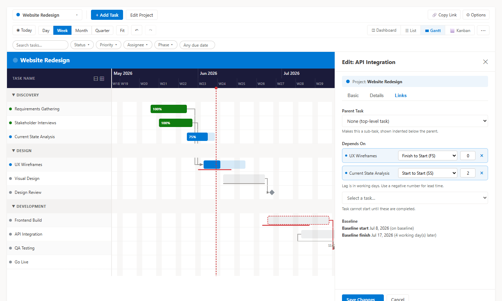

| Field | Notes |
|---|---|
| **Parent Task** | Makes this task a sub-task of another. Sub-tasks are indented under their parent in all views. |
| **Depends On** | Select the tasks this one depends on. Each appears as a removable row — click **×** to remove it. For each link, choose a **link type** and a **lag** (see below). Dependency arrows are drawn on the Gantt chart. |
| **Baseline** | Shows the baseline start and finish (if a baseline has been set) and how many working days earlier or later the task now finishes. |

**Link types and lag**

| Type | Meaning |
|---|---|
| **Finish to Start (FS)** | This task starts after the predecessor finishes (default) |
| **Start to Start (SS)** | This task starts when the predecessor starts |
| **Finish to Finish (FF)** | This task finishes when the predecessor finishes |
| **Start to Finish (SF)** | This task finishes when the predecessor starts |

Lag is measured in working days; use a negative number for lead time. Links are stored in the task's `Dependencies` column in a compact form such as `12,15SS+2` (a plain ID means FS with no lag). A task can have roughly 60 dependencies.

Working days follow the [working calendar](#11-display-settings) configured in the web part property pane.

### Editing a task

- **In the Gantt chart:** click the task name in the left panel, or click the bar in the timeline.
- **In the List view:** click the task name in the Task Name column.
- **In the Kanban view:** click the card title.

### Quick edits without opening the panel

- **Status / Priority (List view):** Click the Status or Priority cell and change it inline — saves immediately.
- **Move dates (Gantt view):** Drag a bar left or right to shift its dates. Tasks that depend on it shift too, and you can click **Undo**.
- **Resize duration (Gantt view):** Drag the right edge of a bar to extend or shorten it.
- **Create a task (Gantt view):** Drag across an empty row to create a task with those dates.
- **Change status (Kanban view):** Drag the card to a different column.
- **Bulk edit (List view):** Tick several rows and set status, priority, % complete, or assignee for all of them at once.
- **Undo / Redo:** Use the toolbar buttons or **Ctrl+Z** / **Ctrl+Y** to step back or forward through your last 50 changes.

### Deleting a task

- **Gantt / List view:** Hover over a task row to reveal the **✕** button and click it.
- **List view (several tasks):** Tick the rows, then choose **Delete selected** in the bulk action bar and confirm.
- **Task panel:** There is no delete button in the panel — delete from the row hover action.

### If you see "changed by someone else"

If two people edit the same task or project at nearly the same time, whoever saves second will see a message and the save is rejected. This protects the first person's changes from being silently overwritten.

- **Tasks:** you'll see *"This task was changed by someone else. The latest tasks have been reloaded — review them and try again."* The task list reloads automatically; re-apply your edit. Saves to the same task are also queued one at a time, so rapid successive edits don't collide with each other.
- **Projects:** you'll see *"This project was changed by someone else since you opened it. Refresh and try again."* Refresh the project (switch away and back, or reload the page), then re-apply your edit.

If SharePoint throttles a request (HTTP 429, 503, or 504), the web part retries automatically with a short delay.

---

## 4. Filtering Tasks

The **Filter Bar** appears as a third row in the toolbar whenever a project has at least one task. It works across all views — Gantt, List, Kanban, and Dashboard — and any active filters stay in place when you switch between views.

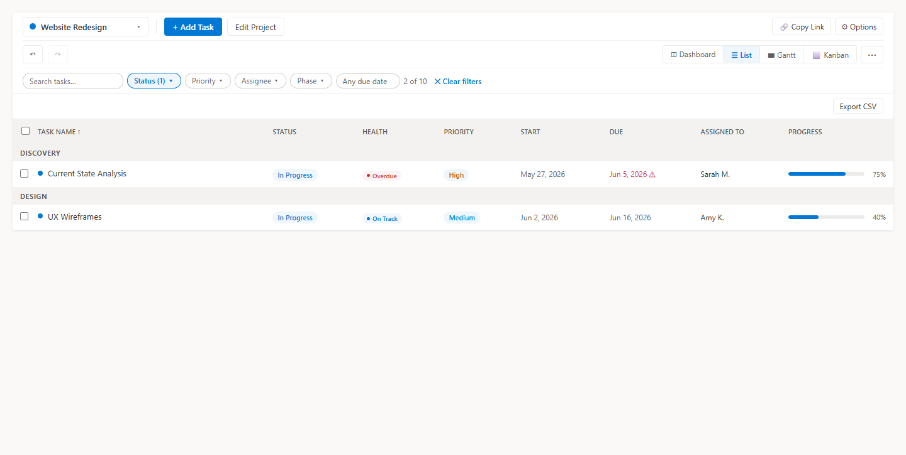

### Filter controls

| Control | What it filters |
|---|---|
| **Search tasks…** | Text input — hides any task whose name does not contain the typed text (case-insensitive) |
| **Status** | Multi-select dropdown — show only tasks with the chosen statuses |
| **Priority** | Multi-select dropdown — show only tasks with the chosen priorities |
| **Assignee** | Multi-select dropdown — show only tasks assigned to the selected people (appears when the project has any assigned tasks) |
| **Phase** | Multi-select dropdown — show only tasks in the selected phases (appears when the project has any phases) |
| **Due** | Dropdown — filter by due date: *Any due date*, *Overdue*, *Due today*, or *Due in 7 days* |

### Reading the filter bar

- Active filters are highlighted in **blue** with the filter name and a count (e.g., **Status (2)**).
- When any filter is active, a **match count** appears to the right of the controls (e.g., *5 of 20*).
- Click **✕ Clear filters** to reset everything at once.
- Filters reset automatically when you switch to a different project.
- Use **🔗 Copy Link** in the ⋯ menu to share a link that opens the same project, view, zoom level, and filters.
- Click an active chip's count badge to open its dropdown and adjust the selection.

### Tips

- Combine filters — for example, search for "design" and set Status to "In Progress" to find only in-progress design tasks.
- Use the **Overdue** due filter with Color Coding set to **By Health** to instantly spot problem tasks.
- Filters do not affect exports — the full task list is always exported regardless of what is currently filtered.

---

## 5. Gantt Chart View

The Gantt view is the heart of the web part. Switch to it using the **Gantt** button in the view switcher on the second toolbar row.

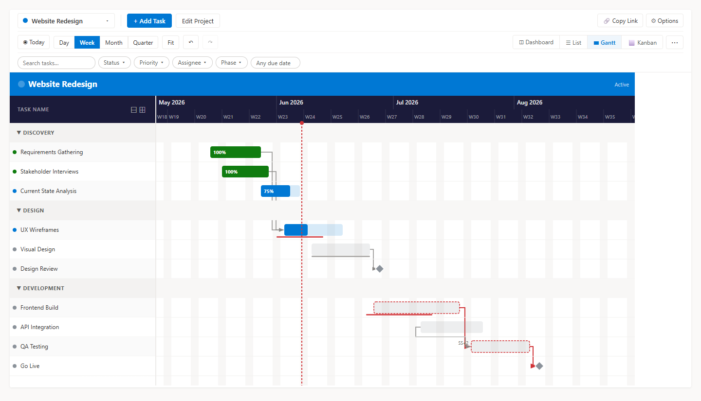

### Layout

```
┌─────────────────────────────────────────────────────────┐
│  Project Name                              [Status]       │  ← Project title bar
├──────────────────┬──────────────────────────────────────┤
│  Task            │  Jun 2026        Jul 2026             │  ← Header (months)
│  Dur.            │  W1   W2   W3   W4  W1   W2   W3    │  ← Header (weeks)
├──────────────────┼──────────────────────────────────────┤
│ ● Discovery      │  [══════════]                        │
│   ● Research     │    [════]                            │
│   ● Kickoff    ◆ │         ◆                            │  ← milestone
│ ● Design         │                [════════════]        │
│   ● Wireframes   │                [══════]              │
│ + Add Task       │                                      │
└──────────────────┴──────────────────────────────────────┘
```

### Navigating the timeline

| Action | How |
|---|---|
| Scroll horizontally | Mouse wheel or scrollbar on the timeline |
| Scroll vertically | Mouse wheel or scrollbar; left panel and timeline scroll together |
| Jump to today | Click **◉ Today** on the toolbar |
| Zoom in/out | Click **Day · Week · Month · Quarter** on the toolbar, or hold **Ctrl** and use the mouse wheel |
| Fit the whole project | Click **Fit** on the toolbar |
| Collapse / expand all phases | Use the **Collapse all phases** / **Expand all phases** button (your choice is remembered per project) |
| Undo / Redo | Toolbar buttons, or **Ctrl+Z** / **Ctrl+Y** |

### Zoom levels

| Level | Best for |
|---|---|
| **Day** | Short sprints or detailed scheduling; shows individual day columns |
| **Week** | Standard project view; shows week numbers |
| **Month** | Multi-month projects; fits more on screen |
| **Quarter** | Long-range roadmaps or annual plans |

### Task bars

- The **colored fill** shows progress (% complete).
- The **lighter background** is the full planned duration.
- **Drag horizontally** to move the task's start and end dates together. A live date label follows the bar, and the timeline scrolls automatically when you drag near its edge. Press **Esc** to cancel; only the primary mouse button starts a drag.
- **Drag the right edge** to change only the end date.
- **Drag across an empty row** to create a new task with those dates.
- **Drag the link handle** from a bar onto another task to create a dependency. Circular or duplicate links are rejected with a message.
- **Move dependents automatically:** when you drop a bar, tasks that depend on it shift to keep their links satisfied. A message shows how many moved, with an **Undo** button.
- **From the keyboard:** Tab to a bar, then press **Left** / **Right** to move it one working day, **Shift + Left** / **Shift + Right** to change its end date, or **Enter** to open it.
- **Hover** over any bar to see a tooltip with full task details.
- On a **touchscreen or with a pen**, the same drag and resize gestures work — touch and drag a bar to move it, or drag its right edge to resize.

### Milestones

A task with **Milestone** toggled on (Details tab of the task panel) renders as a ◆ diamond at its date instead of a bar. Hover it to see the same tooltip as any other task — title, date, status, priority, % complete, and health.

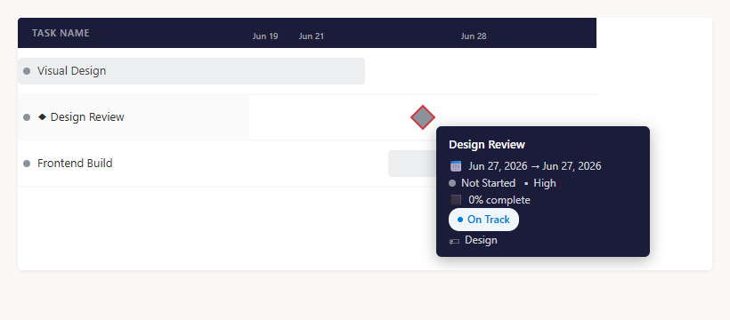

### Phase groups

Tasks with the same Phase value are grouped under a labeled section header. Click the **▶ / ▼** arrow on the left to collapse or expand a phase group, or use **Collapse all / Expand all**. If a task's parent chain is circular (A under B under A), the task is shown at the top level with a warning tooltip instead of being hidden.

### Dependencies

When a task is set to depend on another, an orthogonal connector line is drawn from the predecessor bar to the start of the dependent task. Lines use only horizontal and vertical segments — right-angle elbows for forward dependencies, and routed paths that stay between rows for backward dependencies. Arrows reflect each link's type (FS, SS, FF, or SF) and lag. When you move a bar, its dependents are shifted automatically (with **Undo**).

### Critical path

Turn on **Critical path highlight** in Display Settings to color the critical path's bars and arrows red. The Dashboard also lists the critical path tasks.

### Baselines

Use **📐 Set Baseline…** in the ⋯ menu to save the current start and due dates of all tasks as the baseline (any existing baseline is replaced). The Gantt then draws baseline bars for each task; hover to see the baseline dates and the finish variance in days. The task panel's Links tab shows the same variance. If your account can't edit the list's columns, baselines may be unavailable for that project.

---

## 6. List View

The List view shows all tasks in a spreadsheet-style grid. Switch to it using the **List** button in the view switcher.

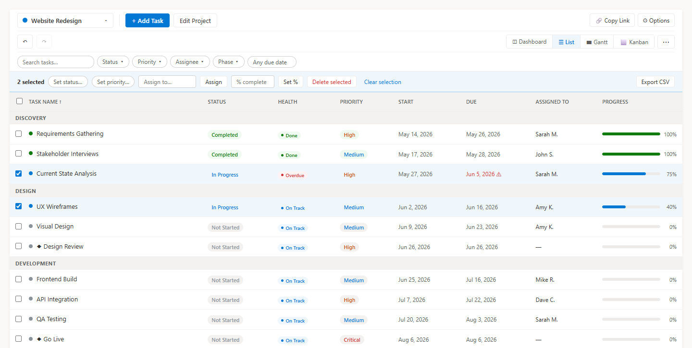

### Sorting

Click any column header to sort by that column. Click again to reverse the order. An arrow (↑ ↓) shows which column is active.

### Inline editing

- **Status:** Click the status badge in the row to open a dropdown and change it immediately.
- **Priority:** Same — click and choose from the dropdown.

Changes save to SharePoint in the background. No need to open the task panel for quick status updates.

### Bulk edit and bulk delete

Tick the checkbox on individual rows (or the header checkbox to select all). A bulk action bar shows the number selected and lets you:

- Set **status** or **priority**
- Set **% complete**
- **Assign** to a person
- **Delete selected** (you'll be asked to confirm)
- **Clear selection**

### Export CSV

Click **Export CSV** to download the tasks as a CSV file.

### Reading the columns

| Column | Notes |
|---|---|
| Task Name | Colored dot shows status; ◆ indicates a milestone; sub-tasks are indented |
| Status | Color-coded badge; click to change inline |
| Health | Automatic On Track / At Risk / Overdue badge — see [Health Status Indicators](#10-health-status-indicators) |
| Priority | Click to change inline |
| Start / Due | Due dates shown in red if overdue; dates on non-working days are marked |
| Assigned To | Avatar + first name |
| Progress | Mini progress bar + percentage |
| Phase | Phase label |
| Predecessors | Names of tasks this task depends on; "—" if none |

---

## 7. Kanban View

The Kanban view organizes tasks as cards across five status columns. Switch to it using the **Kanban** button in the view switcher.

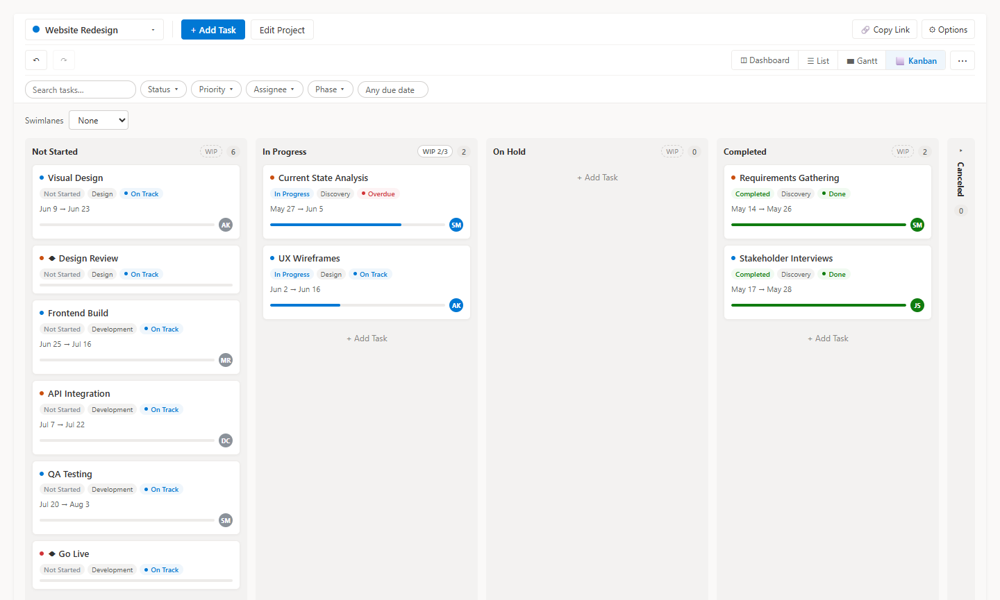

### Columns

| Column | Status |
|---|---|
| Not Started | Tasks not yet begun |
| In Progress | Active work |
| On Hold | Paused or blocked |
| Completed | Done |
| Canceled | No longer needed (the column can be collapsed) |

The number badge on each column header shows the task count. Click the collapse arrow on the Canceled column to fold it away.

### WIP limits

Click **WIP** on a column header to set a work-in-progress limit (0 means no limit). The header then shows *WIP count/limit* and warns when the column is over its limit.

### Swimlanes

Use the **Swimlanes** selector to split the board into horizontal lanes by **Phase** or **Assignee** (or **None**). Tasks with no phase or assignee appear in a *No phase* or *Unassigned* lane.

### Adding a task in a column

Click **Add Task** in a column to open the task panel with that column's status already selected.

### Moving tasks

Drag a card from one column to drop it in another. The task's Status field updates immediately in SharePoint.

> **Tip:** Setting a card to Completed via drag also leaves % Complete as-is. Open the task panel to set it to 100% if needed — or use the List view's inline status dropdown which handles that automatically.

### Reading a card

Each card shows:
- **Priority dot** (color-coded)
- **Task name** (click to open the task panel)
- Status and priority tags
- Phase tag (if set)
- **Health badge** — On Track, At Risk, Overdue, or Done (see [Health Status Indicators](#10-health-status-indicators))
- Start → Due date (Due date shown in red if overdue)
- Progress bar
- Assignee avatar (initials, color-coded by name)

---

## 8. Dashboard View

The Dashboard view gives you a quick snapshot of a single project's health and recent activity. Switch to it using the **Dashboard** button in the view switcher.

### What it shows

- **Summary stats** — task counts broken down by status (Not Started, In Progress, Completed, On Hold, Canceled) and by health (On Track, At Risk, Overdue, Done)
- **Overall progress** — a project-level progress bar based on average % complete across all tasks
- **Phase progress** — done/total and percent per phase. Progress counts leaf tasks only (parents with sub-tasks are excluded) and ignores canceled tasks
- **Overdue tasks** — listed oldest first
- **Burndown** — remaining tasks over time against an ideal line (needs enough dated tasks)
- **Workload by Assignee** — open and overdue task counts per person
- **Critical Path** — the tasks on the project's critical path
- **Recent activity** — a feed of tasks that were completed or updated recently, with assignee and due date

### When to use it

The Dashboard is most useful at the start of a status meeting or a weekly check-in when you want a one-screen summary before diving into the detailed Gantt or List view.

> **Tip:** Combine the Dashboard with the Filter Bar — for example, filter by Assignee to see a summary scoped to one team member's tasks before your one-on-one.

---

## 9. Portfolio View

The Portfolio view gives you a bird's-eye view of all your projects — health, progress, and task counts — without switching between them one at a time.

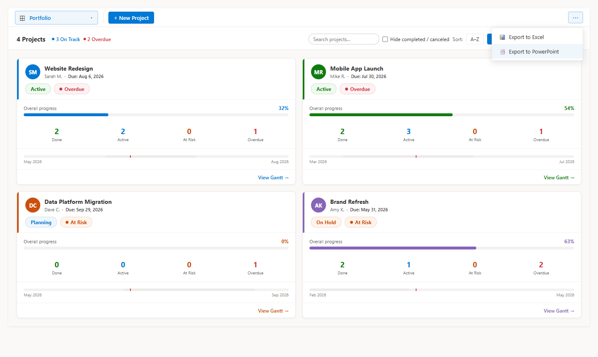

### Opening the Portfolio

Click the **project selector dropdown** (top-left of the toolbar) and choose **⊞ Portfolio** at the top of the list. This is a cross-project view, so the view switcher tabs (Gantt, List, Kanban, Dashboard) are hidden while Portfolio is active.

### Project Cards

Each project appears as a card showing:

| Element | Description |
|---|---|
| **Title + Manager avatar** | Project name and the project manager's initials |
| **Status badge** | The project's manually set status (Active, On Hold, etc.) |
| **Health badge** | Automatically computed health across the project's tasks — On Track, At Risk, Overdue, or Done |
| **Overall progress bar** | Average % complete across all tasks, colored with the project's accent color |
| **Task counts** | Done · Active · At Risk · Overdue — at a glance |
| **Mini timeline** | Horizontal bar spanning the project's date range; a red tick marks today |

### Navigating to a Project

Click any card to open that project in the **Gantt view**.

### Sorting and Refreshing

Use the sort buttons in the Portfolio header to order cards by:

- **A–Z** — alphabetical by project name
- **Health** — worst health first (Overdue → At Risk → On Track → Done)
- **Status** — lifecycle order (Planning, Active, On Hold, Completed, Canceled)
- **% Done** — highest completion first

Your chosen sort order is remembered.

### Searching and hiding

Use the **Search projects…** box to find a project by name, and the **Hide completed / canceled** toggle to hide finished projects. The header shows how many projects match (e.g. *3 of 12 Projects*), and **Clear filters** resets both.

Click **↻ Refresh** to reload stats for all projects. Stats are also refreshed automatically after any task or project is created, edited, or deleted.

---

## 10. Health Status Indicators

Health status is **computed automatically** from task dates and % complete. It is not a field you set — it updates in real time as task data changes.

### How health is calculated

| Health | Condition |
|---|---|
| **Done** | Task status is Completed or Canceled |
| **Overdue** | Due date is in the past and the task is not complete |
| **At Risk** | Start date has passed but the task is still Not Started — OR — % complete is more than 10% behind what would be expected given the time elapsed between start and due date |
| **On Track** | Everything else in progress |

For projects, health is rolled up from tasks: a project is **Overdue** if any Critical or High priority task is overdue; **At Risk** if any Critical or High priority task is at risk, or if any task is overdue; **On Track** otherwise.

### Where health appears

| View | Where |
|---|---|
| **List view** | Health column between Status and Priority |
| **Kanban view** | Badge on each card |
| **Gantt view** | Tooltip on hover; bars can be colored by health (see Display Settings) |
| **Portfolio view** | Badge on each project card; aggregate summary in the header |

### Turning health badges on or off

Open **⚙ Options** → **Show / Hide** → toggle **Health status badges**. When off, badges are hidden in the List, Kanban, and Gantt tooltip. The Portfolio view always shows health regardless of this setting.

---

## 11. Display Settings

Click **⚙ Options** on the toolbar (visible when a project is selected) to open the settings panel. Changes apply instantly — no save button needed.

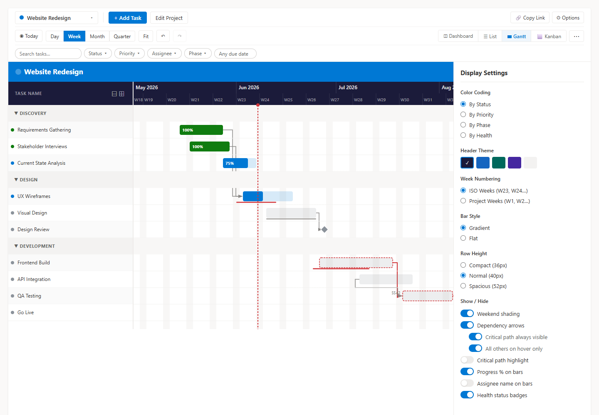

### Color Coding

Controls what determines a task bar's color.

| Option | What it does |
|---|---|
| **By Status** | Not Started = gray · In Progress = blue · Completed = green · On Hold = orange · Canceled = red |
| **By Priority** | Critical = red · High = orange · Medium = blue · Low = green |
| **By Phase** | Each phase name is hashed to a consistent color from a 15-color palette |
| **By Health** | On Track = blue · At Risk = orange · Overdue = red · Done = green |

A task's **Custom Color** (set in the Details tab) always overrides this setting.

### Header Color

Changes the color of the timeline header bar and the left-panel header. Five themes available: Dark, Navy, Teal, Purple, Light.

### Week Numbering

| Option | Looks like | Best for |
|---|---|---|
| **ISO Weeks** | W23, W24, W25… | Teams who reference calendar weeks |
| **Project Weeks** | W1, W2, W3… | Presentations — "done by Week 6" is clearer than "done by W28" |

Project weeks count from the Monday of or before the earliest task start date.

### Bar Style

- **Gradient** — bars fade slightly top-to-bottom (default)
- **Flat** — solid fill, cleaner for screenshots and printing

### Row Height

- **Compact** — fit more tasks on screen; good for overview slides
- **Normal** — default, comfortable for editing
- **Spacious** — easier reading on large monitors

### Show / Hide

| Toggle | What it controls |
|---|---|
| Weekend shading | Light gray stripe on Saturday/Sunday columns |
| Dependency arrows | Orthogonal connector lines between predecessor and successor tasks; two sub-options appear when this is on: |
| ↳ Critical path always visible | Critical path arrows are always drawn on the chart — visible even without hovering |
| ↳ All others on hover only | Non-critical dependency arrows only appear when you hover over a task bar; hovering always reveals all dependency arrows for that task regardless of this setting |
| Critical path highlight | Colors critical path task bars and arrows in red |
| Progress % on bars | Shows e.g. "40%" inside the task bar |
| Assignee name on bars | Shows the assignee's name inside or beside the bar |
| Health status badges | On Track / At Risk / Overdue badges in List, Kanban, and Gantt tooltip |

Settings are remembered in your browser's local storage. Colors follow the SharePoint site theme, and the chart adapts to high-contrast mode.

### Web part property pane (page editors)

Site owners and page editors can set these in the web part's property pane while editing the page:

| Setting | What it does |
|---|---|
| **Default view** | The view shown first: Gantt, List, Kanban, Dashboard, or Portfolio. A viewer's own remembered choice or a shared link takes priority |
| **Default zoom** | The Gantt zoom shown first: Day, Week, Month, or Quarter |
| **Working calendar** | Toggle each weekday as a working day (Monday–Friday by default) and list holidays, one `yyyy-MM-dd` date per line (for example `2026-12-25`). Keyboard moves, dependency lag, and auto-shifted dependents skip non-working days |

---

## 12. Exporting

All export options are in the **⋯ menu** (top-right of the toolbar, when a project is selected).

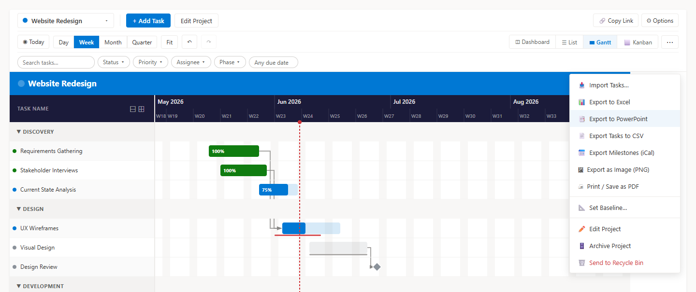

### Export to Excel

Downloads `<Project Name> - Tasks.xlsx` with all tasks in a spreadsheet. Columns are:

Task Name · Phase · Start Date · Due Date · Status · Priority · Assigned To · Assigned To (Email) · % Complete · Is Milestone · Description · Notes

Column widths are auto-sized to fit the content. The file opens directly in Excel, Google Sheets, or any spreadsheet application.

### Export Tasks to CSV

Downloads `<Project Name> - Tasks.csv` (also available as **Export CSV** in the List view). It includes the task columns plus ID, Dependencies, Baseline Start, and Baseline Due.

### Export Milestones (iCal)

Downloads `<Project Name> - Milestones.ics` containing the project's milestones, which you can import into Outlook, Google Calendar, or any calendar app.

### Print / Save as PDF

Choose **🖨 Print / Save as PDF** to open the print dialog for the Gantt chart; pick *Save as PDF* as the printer to create a PDF. If nothing opens, allow pop-ups for the site and try again.

### Portfolio exports

In Portfolio view, the ⋯ menu exports the whole portfolio as Excel, CSV (`Portfolio Summary.csv`), or PowerPoint. The Excel file includes its header row even when there are no projects, and the PowerPoint table continues onto additional slides when there are many projects. Colors are validated on export so a malformed color can't break the file.

### Export to PowerPoint

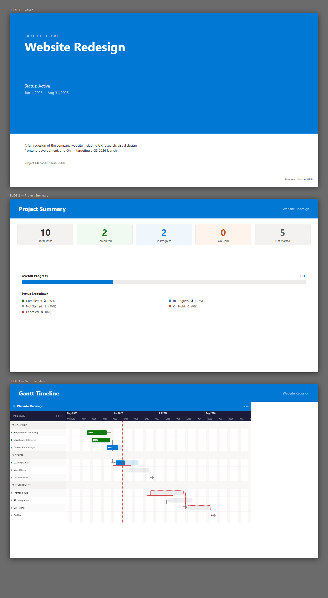

Downloads `<Project Name> - Project Report.pptx` — a ready-to-present four-slide deck:

| Slide | Contents |
|---|---|
| **Cover** | Project title, status, date range, description, and project manager on a branded background |
| **Project Summary** | Task counts by status, overall progress bar, and a status breakdown table |
| **Gantt Timeline** | The full Gantt chart as a high-resolution image, scaled to fill the slide |
| **Summary & Recent Activity** | Project overview on the left; tasks completed or updated in the past 7 days on the right |

### Export as Image (PNG)

Downloads `<Project Name> - Gantt Chart.png` — a high-resolution (2×) PNG of the full Gantt chart.

The export:
- Shows **every task** (not just what's visible on screen)
- Spans the **full date range** from earliest start to latest due date
- Includes the **project title bar** at the top
- Uses your current **Display Settings** (colors, theme, week labels, bar style)
- Is rendered at **2× resolution** for sharp output on retina screens and in presentations

**Tips for a great export:**
1. Switch to **Project Weeks** (W1, W2…) in Display Settings
2. Choose a **header theme** that matches your presentation palette
3. Set **Bar Style** to Flat for cleaner printing
4. Set **Row Height** to Compact to fit more tasks in the image

> **Note:** Exports always include the full task list. Active filters in the Filter Bar do not affect what is exported.

---

## 13. Importing Tasks

There are two import paths depending on whether you already have a project or want to create one from a file.

### Import File as New Project

Click the **project selector dropdown** (top-left of the toolbar) → **📥 Import File as New Project…** to create a brand new project directly from an Excel or CSV file. The import panel opens in "create" mode — it will prompt you for a project name and create the project automatically when you complete the import.

Use this path when you are starting fresh from a spreadsheet or MS Project export and do not yet have a project in Smart Gantt.

### Import Tasks into an Existing Project

Use import to bring tasks into an existing project. Access it from the **⋯ menu** → **Import Tasks…**

The import panel walks you through four steps:

### Step 1 — Source

Choose where your tasks are coming from:

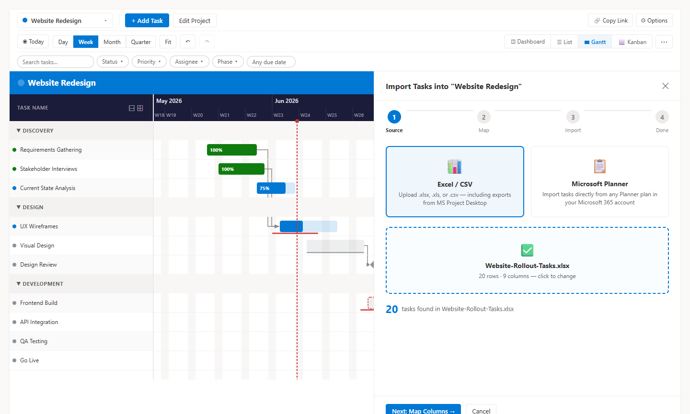

#### Excel / CSV
- Drag and drop a `.xlsx`, `.xls`, `.csv`, or `.ods` file, or click to browse
- Works with exports from Microsoft Project Desktop, Asana, Monday.com, Jira, or any tool that can export to Excel
- **For MS Project Desktop:** File → Save As → Excel Workbook (.xlsx)

#### Microsoft Planner
- Browse your Microsoft 365 Planner plans
- Select the plan to import from — tasks load automatically
- Planner **buckets** map to **Phases**; priority, dates, % complete, and assignees are mapped automatically
- ⚠ Requires a one-time admin approval of Graph API permissions (see IT setup below)

### Step 2 — Map Columns

If the importer can't automatically match all columns, you'll see the Column Mapper.

- **Green "Auto" badges** = matched automatically (e.g. "Task Name" → Title, "Owner" → Assigned To)
- **Unmatched columns** = use the dropdown to pick the right Smart Gantt field, or choose "Skip this column"
- A **preview** of the first 3 rows with your current mapping is shown at the bottom
- **Task Name is required** — required fields are marked, and you'll see a warning if one isn't mapped

**Date order.** If your file has dates written with numbers (such as 03/04/2026), choose how to read them: **Auto-detect** (the panel tells you what it detected), **Month/Day/Year**, or **Day/Month/Year**.

**Dependencies.** Predecessors can be row numbers, task titles, or MS Project style entries such as `3FS+2d` (task 3, Finish to Start, 2 days lag). Numeric predecessors refer to the row's original position in your spreadsheet. Any predecessor that can't be matched, or that points to the task itself, is skipped and reported as a warning.

Common mappings you might need to set manually:

| Source column | Map to |
|---|---|
| Owner, Responsible, Resource | Assigned To |
| Finish, End, Deadline | Due Date |
| % Done, Completion | % Complete |
| Category, Sprint, Bucket, Epic | Phase |
| Comments, Remarks | Notes |

### Step 3 — Import

Before importing, a validation preview lists rows with problems — a missing task name, an invalid start or due date, or a due date before the start date. Tick **Skip rows with problems** to leave those rows out.

Click **Import N Tasks**. A progress bar shows tasks being created. Large imports may take a minute.

### Step 4 — Done

The results screen shows how many tasks were successfully added, lists any rows that failed (e.g. missing required data), and shows any warnings (for example unresolved dependencies). The failed-row and warning lists can be selected, and each has a **Copy details** button that copies the full text to the clipboard — handy for sharing an error with your administrator. Click **View Imported Tasks** to see them on the Gantt.

### IT Setup for Planner Import

Planner import uses the Microsoft Graph API. A **Microsoft 365 admin** needs to approve three permissions once:

1. Deploy the `.sppkg` to the SharePoint App Catalog
2. Go to **SharePoint Admin Center → Advanced → API Access**
3. Approve:
   - `Microsoft Graph — Tasks.Read`
   - `Microsoft Graph — Group.Read.All`
   - `Microsoft Graph — User.ReadBasic.All`

This is a one-time step for the entire tenant.

---

## 14. Working with Multiple Projects

The **project selector dropdown** (top-left of the toolbar) is your hub for navigating between projects. Click it to see:

- **⊞ Portfolio** — see all projects at a glance (health, progress, task counts)
- Individual projects — click any to switch to it
- **+ New Project** — create a new project

Each project is stored in its own SharePoint list, so tasks from different projects are completely separate. There is no cross-project dependency linking.

**To see an overview of all projects:** Select **⊞ Portfolio** from the dropdown. See [Portfolio View](#9-portfolio-view) for details.

**To rename or update a project:** Select the project, then click **Edit Project** in the toolbar (or use the **⋯** menu → **Edit Project**).

**To archive a project:** Use the **⋯** menu → **🗄️ Archive Project**. Archived projects are hidden from the project selector and Portfolio by default — they are not deleted. To see archived projects, open the project selector dropdown and tick **Show archived projects** at the bottom. Archived projects appear at reduced opacity with an "Archived" label.

**To unarchive a project:** Toggle on **Show archived projects**, select the archived project, then use the **⋯** menu → **📂 Unarchive Project**.

**To delete a project:** Use the **⋯** menu → **🗑️ Send to Recycle Bin**. You'll be asked to confirm. The project record and all its tasks are moved to the **SharePoint recycle bin** — they can be recovered from there for up to 93 days.

---

## 15. Accessibility and Touch Support

### Keyboard navigation

- **List view column headers** — Tab to a column header and press **Enter** or **Space** to sort by it, same as clicking.
- **Kanban cards** — Tab to a card. Press **Enter** to open it in the task panel. Press the **Left** or **Right** arrow key to move it to the previous or next status column (the same status/progress rules as dragging apply — see [Kanban View](#7-kanban-view)).
- **Toolbar menus** — The project selector and the **⋯** menus can be opened with Enter or Space once focused, and every item inside them is reachable with Tab and activated with Enter or Space.
- **Gantt bars** — Tab to a bar, then press **Left** / **Right** to move it one working day, **Shift + Left** / **Shift + Right** to change its end date, or **Enter** to open the task. The new dates are announced to screen readers.
- **List view bulk selection** — every row checkbox, the select-all checkbox, and the bulk action bar are labeled and keyboard-operable.
- **Kanban** — WIP limit fields and the **Add Task** button in each column have accessible labels; the Edit and Delete buttons on a card no longer also trigger the card's own Enter/arrow actions.
- **People picker** — the suggestion list has an accessible label and the number of suggestions is announced to screen readers.
- **Drag cancel** — press **Esc** during a Gantt drag to cancel it.

### Themes and high contrast

Colors follow the SharePoint site theme, and the web part adapts to Windows high-contrast mode.

### Touch and pen support

Dragging and resizing task bars on the Gantt chart works with touch and pen input, not just a mouse — see [Gantt Chart View](#5-gantt-chart-view).

---

## 16. Language Support

Smart Gantt Chart's interface — toolbar, views, panels, settings, and export/import screens — is fully localized into 30 languages:

Arabic · Chinese (Simplified) · Chinese (Traditional) · Czech · Danish · Dutch · English · Finnish · French · German · Greek · Hebrew · Hindi · Hungarian · Indonesian · Italian · Japanese · Korean · Norwegian Bokmål · Polish · Portuguese (Brazil) · Portuguese (Portugal) · Romanian · Russian · Spanish · Swedish · Thai · Turkish · Ukrainian · Vietnamese

### How the language is chosen

There is no language picker inside the web part. The displayed language automatically follows the **language of the SharePoint page**, which in turn follows the current user's personal language setting (or the site's default language, for a site without per-user language settings):

- **Per-user:** each person can set their own preferred display language in **SharePoint → Settings (gear icon) → Language and time zone**. This affects what they see in Smart Gantt Chart without affecting any other user.
- **Per-site:** if multi-language site features are enabled, site owners can set a default site language under **Site Settings → Language Settings**.

If a user's selected language isn't one of the 30 above, the web part falls back to **English**.

> **Note:** Only the on-screen labels, buttons, and messages are translated. Data you enter yourself — task names, descriptions, notes, phase names, and assignee names — always appears exactly as typed, in whatever language you entered it. Status and Priority values are stored internally in English and only their displayed label is translated, so filtering, sorting, and exports behave consistently regardless of a user's display language.

---

## 17. Tips and Tricks

**Keep Phase names consistent**
The Phase field autocompletes from existing values in the project. Using the same spelling every time ensures tasks are grouped correctly on the Gantt. A typo like "Desgin" instead of "Design" creates a separate group.

**Use milestones for key deliverables**
Toggle **Is Milestone** on for go-live dates, review meetings, or client handoffs. They appear as ◆ diamonds on the Gantt and stand out clearly in presentations.

**Color by Phase for presentations**
In Display Settings, set Color Coding to **By Phase**. Each phase gets its own consistent color, making it immediately clear which work belongs to which project area.

**Project-relative weeks for stakeholder slides**
Switch Week Numbering to **Project Weeks** before exporting. "Complete by W6" is clearer to stakeholders than "complete by W28."

**Sub-tasks for detailed work**
Use the **Parent Task** field to create a hierarchy. The parent task's dates should span all its sub-tasks. Sub-tasks appear indented in both the Gantt and List views.

**Bulk status updates via List view**
Need to mark 10 tasks as Completed? Switch to List view, tick the rows, and use the bulk action bar to set the status for all of them at once.

**Set a baseline before the plan starts to slip**
Once your plan is agreed, use **Set Baseline…** in the ⋯ menu. The Gantt then shows how far each task has drifted from the original dates.

**Set your working calendar once**
If your team doesn't work Monday to Friday, or has company holidays, edit the web part's property pane so lag, keyboard moves, and auto-shifted dependents skip non-working days.

**Share exactly what you're looking at**
Use **🔗 Copy Link** in the ⋯ menu to send a colleague a link that opens the same project, view, zoom, and filters.

**Mistakes happen — Undo**
Dragged the wrong bar? Press **Ctrl+Z** (or the Undo button). Dependent tasks that were shifted move back with it.

**Import to seed a new project**
Start a project in Excel with your work breakdown structure, then import it. Mapping takes less than a minute and saves a lot of manual entry.

**The ⋯ menu**
The three-dot menu in the top-right of the toolbar contains all the less-common actions: Import Tasks, Export to Excel, Export Tasks to CSV, Export to PowerPoint, Export as Image, Export Milestones (iCal), Print / Save as PDF, Set Baseline, Copy Link, Edit Project, Archive Project, and Send to Recycle Bin. In Portfolio view, the same ⋯ menu contains the Excel, CSV, and PowerPoint exports for the full portfolio.

**Archive projects you no longer actively manage**
Rather than deleting a completed or cancelled project, use **Archive Project** to hide it from view. It stays in SharePoint and can be restored at any time via **Show archived projects** in the project selector. This is safer than deleting and keeps historical task data intact.

**Use Portfolio for a weekly status check**
Start your Monday by opening ⊞ Portfolio. Any project card showing At Risk or Overdue health immediately tells you where attention is needed — without having to click into each project.

**Color bars by health for a quick visual scan**
In Display Settings, set Color Coding to **By Health**. Every overdue task turns red and every at-risk task turns orange — helpful for spotting scheduling problems across a large project at a glance.

**Health is computed from % Complete and dates — keep both updated**
Health status checks whether your actual progress matches the time elapsed. A task that is 0% complete two weeks after its start date will show as At Risk even if the due date hasn't passed yet. Update % Complete regularly (the slider in the task panel or the Kanban card drag both work) to get an accurate health picture.

**Turn off health badges before exporting for a cleaner image**
If the health badges feel visually busy in an export or presentation, open **⚙ Options → Show / Hide** and toggle off **Health status badges** before exporting to PNG or PowerPoint.

**Use the Filter Bar to focus a large project**
On projects with 50+ tasks, use the Filter Bar (third toolbar row) to narrow down to what matters. Filter by Assignee before a one-on-one, by Phase during a sprint review, or by Due → Overdue for your daily triage. The filter state persists as you switch between Gantt, List, Kanban, and Dashboard views.

**Combine filters for surgical precision**
Filters stack — set Status to "In Progress", Phase to "Build", and Due to "Due in 7 days" to see exactly which active build tasks need attention this week. Click **✕ Clear filters** to reset everything at once.
