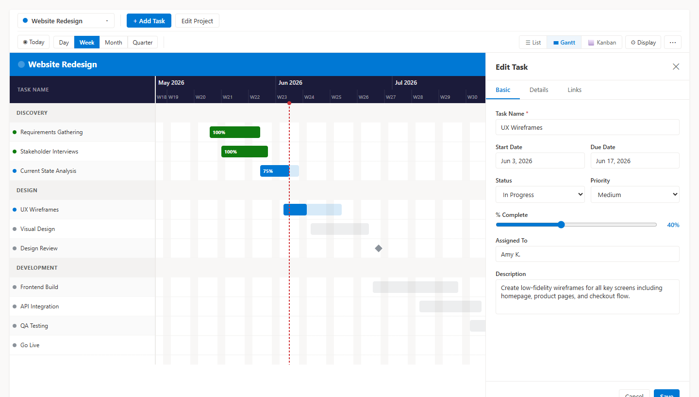

# Smart Gantt Chart — User Guide

---

## Table of Contents

1. [Getting Started](#1-getting-started)
2. [Creating Your First Project](#2-creating-your-first-project)
3. [Adding and Editing Tasks](#3-adding-and-editing-tasks)
4. [Gantt Chart View](#4-gantt-chart-view)
5. [List View](#5-list-view)
6. [Kanban View](#6-kanban-view)
7. [Display Settings](#7-display-settings)
8. [Exporting](#8-exporting)
9. [Importing Tasks](#9-importing-tasks)
10. [Working with Multiple Projects](#10-working-with-multiple-projects)
11. [Tips and Tricks](#11-tips-and-tricks)

---

## 1. Getting Started

When you first add the **Smart Gantt Chart** web part to a SharePoint page, it will create a background list called `SmartGantt_Projects` on the current site to track your projects. You'll see this message:

> *No projects yet — Create your first project*

You'll need **Site Owner** permissions on the SharePoint site for this first-time setup (list creation). After that, any **Site Member** can add tasks, edit tasks, and switch views.

---

## 1a. Guest & External User Access

Microsoft 365 **guest users** (external collaborators invited via Azure AD B2B) are fully supported for day-to-day project work, with two exceptions.

### What guests can do

Guests who have been invited to the SharePoint site and granted **Site Member (Contribute)** permission can:

- View projects in all views — Gantt, List, Kanban, and Dashboard
- Add, edit, and delete tasks
- Export to Excel, PowerPoint, and PNG
- Import tasks from an Excel or CSV file
- Be listed as "Assigned To" on any task — this field is plain text and requires no Azure AD account lookup

### What guests cannot do

| Action | Reason | Workaround |
|---|---|---|
| **Create a new project** | Creating a SharePoint list requires "Manage Lists" permission, which is not available to guests | Have an internal Site Owner or Member create the project; the guest then manages tasks within it |
| **Planner import** | Reading organizational Planner plans via the Microsoft Graph requires a same-tenant license; guests are typically excluded | Export the Planner plan to Excel (Planner → Export plan → Excel), then use the Excel import path |

### Inviting a guest

1. Go to the SharePoint site → **Settings → Site Permissions → Invite People**
2. Enter the guest's email address and set their permission to **Edit** (Contribute / Site Member)
3. The guest receives an email invitation; they must sign in with a Microsoft account before accessing the site
4. Once in, they can use the web part immediately for any projects that already exist

> **Tip:** Create all projects you want the guest to work in *before* they arrive, so they can start adding tasks right away without waiting for an owner to be available.

---

## 2. Creating Your First Project

1. Click **+ New Project** in the toolbar (or click the project selector and choose **+ New Project** at the bottom of the dropdown).

2. Fill in the project details:

   | Field | Description |
   |---|---|
   | **Project Name** | Required. Shown in the title bar and project selector. |
   | **Description** | Optional. A short summary of what the project is about. |
   | **Color** | Pick a color — it's used as the project accent color throughout the Gantt view. |
   | **Status** | Planning, Active, On Hold, Completed, or Cancelled. |
   | **Start Date / Due Date** | Optional project-level date range. |

3. Click **Create Project**.

   A new SharePoint list is created in the background for this project's tasks. You'll see it in the project selector from now on.

> **Tip:** Choose a distinct color for each project if you manage several — it makes switching between them much easier at a glance.

---

## 3. Adding and Editing Tasks

### Adding a task

Click **+ Add Task** in the toolbar. The task panel slides in from the right with three tabs.



#### Basic tab

| Field | Notes |
|---|---|
| **Task Name** | Required. Keep it short — it's what appears on the Gantt bar. |
| **Description** | Optional longer description. |
| **Start Date / Due Date** | Used to position and size the bar on the Gantt chart. |
| **Status** | Not Started · In Progress · Completed · On Hold · Cancelled |
| **Priority** | Critical · High · Medium · Low |
| **% Complete** | Drag the slider 0–100. Setting Status to Completed auto-sets this to 100. |
| **Assigned To** | Start typing — the field suggests people already assigned to tasks in this project. |

#### Details tab


| Field | Notes |
|---|---|
| **Phase** | Groups tasks into labeled sections on the Gantt. Start typing to see phases already used in this project — keeping spelling consistent is important for grouping to work correctly. Tasks in a phase automatically inherit the phase's color unless a custom color is set. |
| **Milestone** | Toggle on for key deliverables. Milestones render as a ◆ diamond on the Gantt instead of a bar. |
| **Custom Color** | Choose any color from the palette or click the rainbow swatch to open the full color picker. Leave blank (Auto) to use the phase color, or the color set in Display Settings. |
| **Notes** | Free-text field for links, context, decisions, or meeting notes. |

#### Links tab


| Field | Notes |
|---|---|
| **Parent Task** | Makes this task a sub-task of another. Sub-tasks are indented under their parent in all views. |
| **Depends On** | Select tasks that must be completed before this one can start. Selected tasks appear as removable chips — click **×** to remove one. Dependency arrows are drawn on the Gantt chart. |

### Editing a task

- **In the Gantt chart:** click the task name in the left panel, or click the bar in the timeline.
- **In the List view:** click the task name in the Task Name column.
- **In the Kanban view:** click the card title.

### Quick edits without opening the panel

- **Status / Priority (List view):** Click the Status or Priority cell and change it inline — saves immediately.
- **Move dates (Gantt view):** Drag a bar left or right to shift its dates.
- **Resize duration (Gantt view):** Drag the right edge of a bar to extend or shorten it.
- **Change status (Kanban view):** Drag the card to a different column.

### Deleting a task

- **Gantt / List view:** Hover over a task row to reveal the **✕** button and click it.
- **Task panel:** There is no delete button in the panel — delete from the row hover action.

---

## 4. Gantt Chart View

The Gantt view is the heart of the web part. Switch to it using the **Gantt** button in the view switcher on the second toolbar row.


### Layout

```
┌─────────────────────────────────────────────────────────┐
│  Project Name                              [Status]       │  ← Project title bar
├──────────────────┬──────────────────────────────────────┤
│  Task            │  Jun 2026        Jul 2026             │  ← Header (months)
│  Dur.            │  W1   W2   W3   W4  W1   W2   W3    │  ← Header (weeks)
├──────────────────┼──────────────────────────────────────┤
│ ● Discovery      │  [══════════]                        │
│   ● Research     │    [════]                            │
│   ● Kickoff    ◆ │         ◆                            │  ← milestone
│ ● Design         │                [════════════]        │
│   ● Wireframes   │                [══════]              │
│ + Add Task       │                                      │
└──────────────────┴──────────────────────────────────────┘
```

### Navigating the timeline

| Action | How |
|---|---|
| Scroll horizontally | Mouse wheel or scrollbar on the timeline |
| Scroll vertically | Mouse wheel or scrollbar; left panel and timeline scroll together |
| Jump to today | Click **◉ Today** on the toolbar |
| Zoom in/out | Click **Day · Week · Month · Quarter** on the toolbar |

### Zoom levels

| Level | Best for |
|---|---|
| **Day** | Short sprints or detailed scheduling; shows individual day columns |
| **Week** | Standard project view; shows week numbers |
| **Month** | Multi-month projects; fits more on screen |
| **Quarter** | Long-range roadmaps or annual plans |

### Task bars

- The **colored fill** shows progress (% complete).
- The **lighter background** is the full planned duration.
- **Drag horizontally** to move the task's start and end dates together.
- **Drag the right edge** to change only the end date.
- **Hover** over any bar to see a tooltip with full task details.

### Phase groups

Tasks with the same Phase value are grouped under a labeled section header. Click the **▶ / ▼** arrow on the left to collapse or expand a phase group.

### Dependencies

When a task is set to depend on another, a curved arrow is drawn from the end of the predecessor bar to the start of the dependent task. These are informational — moving bars does not automatically enforce date constraints.

---

## 5. List View

The List view shows all tasks in a spreadsheet-style grid. Switch to it using the **List** button in the view switcher.


### Sorting

Click any column header to sort by that column. Click again to reverse the order. An arrow (↑ ↓) shows which column is active.

### Inline editing

- **Status:** Click the status badge in the row to open a dropdown and change it immediately.
- **Priority:** Same — click and choose from the dropdown.

Changes save to SharePoint in the background. No need to open the task panel for quick status updates.

### Reading the columns

| Column | Notes |
|---|---|
| Task Name | Colored dot shows status; ◆ indicates a milestone; sub-tasks are indented |
| Status | Color-coded badge; click to change inline |
| Priority | Click to change inline |
| Start / Due | Due dates shown in red if overdue |
| Assigned To | Avatar + first name |
| Progress | Mini progress bar + percentage |
| Phase | Phase label |

---

## 6. Kanban View

The Kanban view organizes tasks as cards across five status columns. Switch to it using the **Kanban** button in the view switcher.


### Columns

| Column | Status |
|---|---|
| Not Started | Tasks not yet begun |
| In Progress | Active work |
| On Hold | Paused or blocked |
| Completed | Done |
| Cancelled | No longer needed |

The number badge on each column header shows the task count.

### Moving tasks

Drag a card from one column to drop it in another. The task's Status field updates immediately in SharePoint.

> **Tip:** Setting a card to Completed via drag also leaves % Complete as-is. Open the task panel to set it to 100% if needed — or use the List view's inline status dropdown which handles that automatically.

### Reading a card

Each card shows:
- **Priority dot** (color-coded)
- **Task name** (click to open the task panel)
- Status and priority tags
- Phase tag (if set)
- Start → Due date (Due date shown in red if overdue)
- Progress bar
- Assignee avatar (initials, color-coded by name)

---

## 7. Display Settings

Click **⚙ Display** on the toolbar (visible in Gantt view only) to open the settings panel. Changes apply instantly — no save button needed.


### Color Coding

Controls what determines a task bar's color.

| Option | What it does |
|---|---|
| **By Status** | Not Started = gray · In Progress = blue · Completed = green · On Hold = orange · Cancelled = red |
| **By Priority** | Critical = red · High = orange · Medium = blue · Low = green |
| **By Phase** | Each phase name is hashed to a consistent color from a 15-color palette |

A task's **Custom Color** (set in the Details tab) always overrides this setting.

### Header Color

Changes the color of the timeline header bar and the left-panel header. Five themes available: Dark, Navy, Teal, Purple, Light.

### Week Numbering

| Option | Looks like | Best for |
|---|---|---|
| **ISO Weeks** | W23, W24, W25… | Teams who reference calendar weeks |
| **Project Weeks** | W1, W2, W3… | Presentations — "done by Week 6" is clearer than "done by W28" |

Project weeks count from the Monday of or before the earliest task start date.

### Bar Style

- **Gradient** — bars fade slightly top-to-bottom (default)
- **Flat** — solid fill, cleaner for screenshots and printing

### Row Height

- **Compact** — fit more tasks on screen; good for overview slides
- **Normal** — default, comfortable for editing
- **Spacious** — easier reading on large monitors

### Show / Hide

| Toggle | What it controls |
|---|---|
| Weekend shading | Light gray stripe on Saturday/Sunday columns |
| Dependency arrows | Curved arrows between predecessor and successor tasks |
| Progress % on bars | Shows e.g. "40%" inside the task bar |
| Assignee name on bars | Shows the assignee's name inside or beside the bar |

---

## 8. Exporting

All export options are in the **⋯ menu** (top-right of the toolbar, when a project is selected).


### Export to Excel

Downloads `<Project Name> - Tasks.xlsx` with all tasks in a spreadsheet. Columns are:

Task Name · Phase · Start Date · Due Date · Status · Priority · Assigned To · Assigned To (Email) · % Complete · Is Milestone · Description · Notes

Column widths are auto-sized to fit the content. The file opens directly in Excel, Google Sheets, or any spreadsheet application.

### Export to PowerPoint


Downloads `<Project Name> - Project Report.pptx` — a ready-to-present four-slide deck:

| Slide | Contents |
|---|---|
| **Cover** | Project title, status, date range, description, and project manager on a branded background |
| **Project Summary** | Task counts by status, overall progress bar, and a status breakdown table |
| **Gantt Timeline** | The full Gantt chart as a high-resolution image, scaled to fill the slide |
| **Summary & Recent Activity** | Project overview on the left; tasks completed or updated in the past 7 days on the right |

### Export as Image (PNG)

Downloads `<Project Name> - Gantt Chart.png` — a high-resolution (2×) PNG of the full Gantt chart.

The export:
- Shows **every task** (not just what's visible on screen)
- Spans the **full date range** from earliest start to latest due date
- Includes the **project title bar** at the top
- Uses your current **Display Settings** (colors, theme, week labels, bar style)
- Is rendered at **2× resolution** for sharp output on retina screens and in presentations

**Tips for a great export:**
1. Switch to **Project Weeks** (W1, W2…) in Display Settings
2. Choose a **header theme** that matches your presentation palette
3. Set **Bar Style** to Flat for cleaner printing
4. Set **Row Height** to Compact to fit more tasks in the image

---

## 9. Importing Tasks

Use import to bring existing tasks into a project. Access it from the **⋯ menu** → **Import Tasks…**

The import panel walks you through four steps:

### Step 1 — Source

Choose where your tasks are coming from:

#### Excel / CSV
- Drag and drop a `.xlsx`, `.xls`, `.csv`, or `.ods` file, or click to browse
- Works with exports from Microsoft Project Desktop, Asana, Monday.com, Jira, or any tool that can export to Excel
- **For MS Project Desktop:** File → Save As → Excel Workbook (.xlsx)

#### Microsoft Planner
- Browse your Microsoft 365 Planner plans
- Select the plan to import from — tasks load automatically
- Planner **buckets** map to **Phases**; priority, dates, % complete, and assignees are mapped automatically
- ⚠ Requires a one-time admin approval of Graph API permissions (see IT setup below)

### Step 2 — Map Columns

If the importer can't automatically match all columns, you'll see the Column Mapper.

- **Green "Auto" badges** = matched automatically (e.g. "Task Name" → Title, "Owner" → Assigned To)
- **Unmatched columns** = use the dropdown to pick the right Smart Gantt field, or choose "Skip this column"
- A **preview** of the first 3 rows with your current mapping is shown at the bottom
- **Task Name is required** — you'll see a warning if it isn't mapped

Common mappings you might need to set manually:

| Source column | Map to |
|---|---|
| Owner, Responsible, Resource | Assigned To |
| Finish, End, Deadline | Due Date |
| % Done, Completion | % Complete |
| Category, Sprint, Bucket, Epic | Phase |
| Comments, Remarks | Notes |

### Step 3 — Import

Click **Import N Tasks**. A progress bar shows tasks being created. Large imports may take a minute.

### Step 4 — Done

The results screen shows how many tasks were successfully added and lists any rows that failed (e.g. missing required data). Click **View Imported Tasks** to see them on the Gantt.

### IT Setup for Planner Import

Planner import uses the Microsoft Graph API. A **Microsoft 365 admin** needs to approve three permissions once:

1. Deploy the `.sppkg` to the SharePoint App Catalog
2. Go to **SharePoint Admin Center → Advanced → API Access**
3. Approve:
   - `Microsoft Graph — Tasks.Read`
   - `Microsoft Graph — Group.Read.All`
   - `Microsoft Graph — User.ReadBasic.All`

This is a one-time step for the entire tenant.

---

## 10. Working with Multiple Projects

The project selector dropdown (top-left of the toolbar) shows all your projects. Click it to switch between them or create a new one.

Each project is stored in its own SharePoint list, so tasks from different projects are completely separate. There is no cross-project dependency linking.

**To rename or update a project:** Select the project, then click **Edit Project** in the toolbar (or use the **⋯** menu → **Edit Project**).

**To delete a project:** Use the **⋯** menu → **Delete Project**. You'll be asked to confirm. This permanently deletes the project record **and** the entire task list — there is no undo.

---

## 11. Tips and Tricks

**Keep Phase names consistent**
The Phase field autocompletes from existing values in the project. Using the same spelling every time ensures tasks are grouped correctly on the Gantt. A typo like "Desgin" instead of "Design" creates a separate group.

**Use milestones for key deliverables**
Toggle **Is Milestone** on for go-live dates, review meetings, or client handoffs. They appear as ◆ diamonds on the Gantt and stand out clearly in presentations.

**Color by Phase for presentations**
In Display Settings, set Color Coding to **By Phase**. Each phase gets its own consistent color, making it immediately clear which work belongs to which project area.

**Project-relative weeks for stakeholder slides**
Switch Week Numbering to **Project Weeks** before exporting. "Complete by W6" is clearer to stakeholders than "complete by W28."

**Sub-tasks for detailed work**
Use the **Parent Task** field to create a hierarchy. The parent task's dates should span all its sub-tasks. Sub-tasks appear indented in both the Gantt and List views.

**Bulk status updates via List view**
Need to mark 10 tasks as Completed? Switch to List view and update each status cell inline — faster than opening each task panel individually.

**Import to seed a new project**
Start a project in Excel with your work breakdown structure, then import it. Mapping takes less than a minute and saves a lot of manual entry.

**The ⋯ menu**
The three-dot menu in the top-right of the toolbar contains all the less-common actions: Import, Export to Excel, Export to PowerPoint, Export as Image, Edit Project, and Delete Project.
